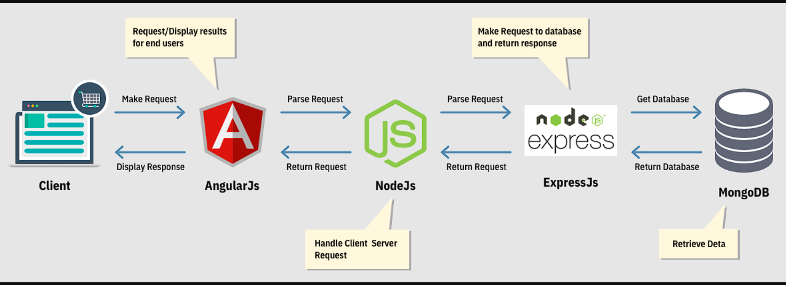

# Advanced E-Commerce Platform

An advanced and scalable e-commerce solution built using **Node.js**, **Express**, **MongoDB**, and **TypeScript**. This platform offers comprehensive product management, shopping cart functionality, and a robust order handling system, delivering a seamless online shopping experience.

---

## ✨ Features

### User-Focused Features:
- **User Authentication & Security**:  
  Secure registration, login, and password recovery with email verification and JWT-based authentication.
- **Product Browsing & Advanced Search**:  
  Explore products by category and subcategory with powerful search, filtering, and sorting options (price, rating, etc.).
- **Pagination Support**:  
  Paginated product lists for efficient browsing.
- **Shopping Cart & Wishlist**:  
  Add, update, and remove products from the cart with dynamic cost calculation. Manage your wishlist for favorite items.
- **Coupon Support**:  
  Apply discount coupons during checkout.
- **Order Processing**:  
  Review orders before finalizing and view order summaries.

### Admin Features:
- **Category & Product Management**:  
  Full CRUD operations for categories, subcategories, and products, including stock and pricing management.
- **Order Management**:  
  Admin interface for viewing and managing customer orders.

---

## 🛠️ Technologies Used

- **Node.js & Express.js**: Building a robust RESTful API.
- **MongoDB & Mongoose**: Database management with structured schemas.
- **TypeScript**: Ensuring type safety and scalable code.
- **JWT Authentication**: For secure user authentication and session handling.
- **Bcrypt**: For securely hashing user passwords.
- **Express Validator**: Input validation for API requests.

---

## ⚙️ Key Functionalities

### Authentication & Authorization:
- Secure login and registration using **JWT**.
- Email verification and password reset functionality.

### Product & Category Management:
- CRUD operations for products and categories.
- Manage product availability and stock in real-time.

### Shopping Cart & Orders:
- Dynamic cart management with total price calculations.
- Apply coupons and track discounts.
- Complete order placement and tracking.

---
